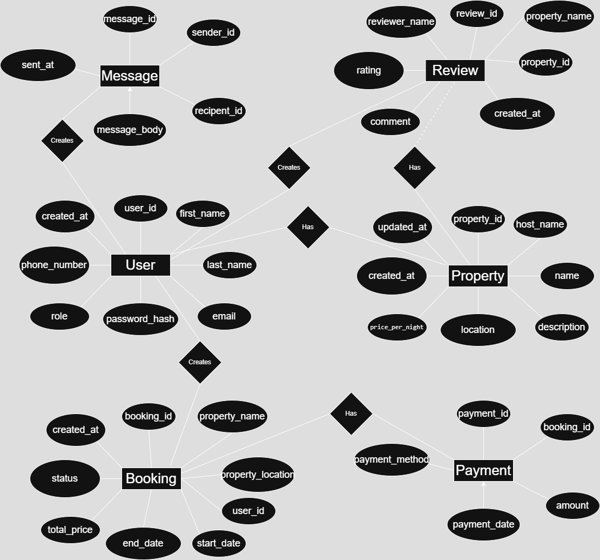

## Entities and Relationships

### 1. User
- Can have **many Properties** (if role is `host`)
- Can make **many Bookings**
- Can write **many Reviews**
- Can send and receive **Messages**

### 2. Property
- Belongs to **one User** (host)
- Can have **many Bookings**
- Can have **many Reviews**

### 3. Booking
- Belongs to **one Property**
- Belongs to **one User** (guest)
- May have **one Payment** (or include payment info if denormalized)

### 4. Payment *(optional if denormalized into Booking)*
- Belongs to **one Booking**

### 5. Review
- Belongs to **one Property**
- Belongs to **one User** (reviewer)

### 6. Message
- Sent by **one User** (sender)
- Received by **one User** (recipient)

