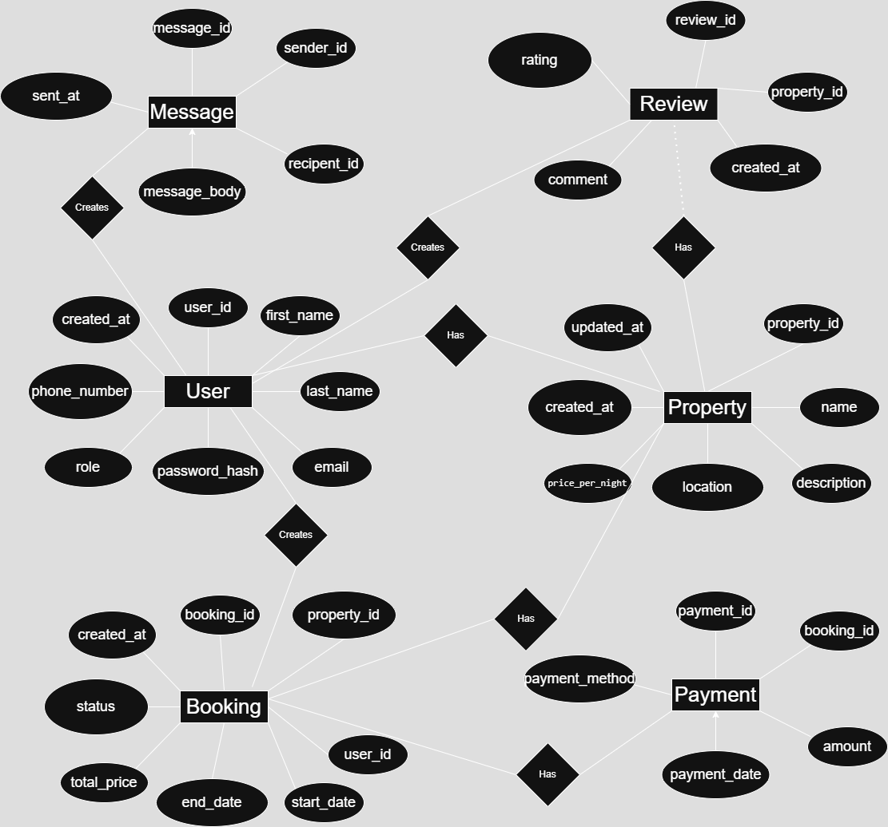

# Database Normalization Review and Adjustment

## ✅ Initial Schema Overview

The initial schema contains the following entities:

- **User**
- **Property**
- **Booking**
- **Payment**
- **Review**
- **Message**

Each table has a clear primary key, and foreign key relationships are properly defined. The schema is mostly normalized but contains some minor opportunities for refinement.

---

## ⚠️ Identified Redundancies & Potential Violations

### 1. **Property Table**
- `host_id` is a foreign key to `User`, which is correct.
- No redundancy found here, but if you denormalized (e.g., added `host_name`), it would violate 3NF.

### 2. **Booking Table**
- `property_id`, `user_id`, and `total_price` are fine.
- However, if **payment info is included** directly (e.g., `payment_method`, `payment_date`), it introduces **repetition** for cases like multiple payments per booking or changes over time, violating 3NF.

### 3. **Review Table**
- Storing `reviewer_name` or `property_name` would be redundant because they can be retrieved via joins.

### 4. **Message Table**
- No issues; messages are clearly tied to `sender_id` and `recipient_id`.

---

## ✅ Normalization to 3NF

To achieve **Third Normal Form (3NF)**, we ensure:

1. The schema is in 2NF (all non-key attributes fully depend on the entire primary key).
2. There are **no transitive dependencies** — non-key attributes should not depend on other non-key attributes.

### Changes Made:

- **Remove redundant fields** like `host_name`, `property_name`, and `reviewer_name` from denormalized tables.
- Ensure **payment information is in its own table** instead of embedded in `Booking`.
- Only keep foreign keys to relate entities; derived fields should be queried via JOINs.

---

## ✅ Final 3NF-Compliant Schema

### User
- `user_id` (PK)
- `first_name`
- `last_name`
- `email` (UNIQUE)
- `password_hash`
- `phone_number`
- `role` (ENUM: guest, host, admin)
- `created_at`

### Property
- `property_id` (PK)
- `host_id` (FK → User)
- `name`
- `description`
- `location`
- `price_per_night`
- `created_at`
- `updated_at`

### Booking
- `booking_id` (PK)
- `property_id` (FK → Property)
- `user_id` (FK → User)
- `start_date`
- `end_date`
- `total_price`
- `status` (ENUM: pending, confirmed, canceled)
- `created_at`

### Payment
- `payment_id` (PK)
- `booking_id` (FK → Booking)
- `amount`
- `payment_date`
- `payment_method` (ENUM: credit_card, paypal, stripe)

### Review
- `review_id` (PK)
- `property_id` (FK → Property)
- `user_id` (FK → User)
- `rating` (INTEGER, 1–5)
- `comment`
- `created_at`

### Message
- `message_id` (PK)
- `sender_id` (FK → User)
- `recipient_id` (FK → User)
- `message_body`
- `sent_at`

---

## ✅ Conclusion

- The final schema adheres to **Third Normal Form (3NF)**.
- All redundancies and transitive dependencies have been removed.
- Each table represents a single subject and links to related data through foreign keys.

This ensures better **data integrity**, easier **maintenance**, and more **flexible querying** in relational databases.

